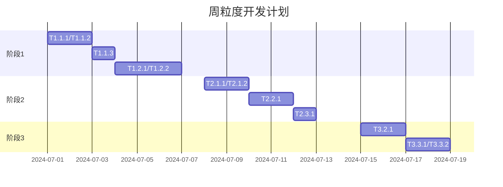

以下根据项目管理文档细化的开发任务清单，按**阶段-模块-功能点**三级拆分，适配独立开发者+AI辅助的工作模式。任务设计遵循「最小可验证」原则，每项任务耗时控制在0.5-2天内：

---

### **阶段1：核心Agent引擎（W1-W3）**
#### **模块1.1：任务分解Agent**
| 任务ID | 任务描述                          | 技术实现                                                                 | AI辅助点                         | 输出物                 |
|--------|---------------------------------|--------------------------------------------------------------------------|----------------------------------|----------------------|
| T1.1.1 | 自然语言需求解析                | 用LangChain定义`TaskPlanningChain`，输入Prompt模板调用Claude 3.5          | Cursor生成Prompt优化代码          | `task_planner.py`    |
| T1.1.2 | JSON任务清单生成                | 解析模型输出→强制JSON格式（`Pydantic`校验），示例：`["create_api_route", ...]` | Cursor写Pydantic模型类           | `schemas/task.py`    |
| T1.1.3 | 任务验证Agent搭建               | 用CrewAI创建`ReviewerAgent`，检查任务可行性（Chain-of-Verification）        | LangChain官方文档案例改造         | `agents/reviewer.py` |

#### **模块1.2：代码生成Agent**
| 任务ID | 任务描述                          | 技术实现                                                                 | AI辅助点                         | 输出物                 |
|--------|---------------------------------|--------------------------------------------------------------------------|----------------------------------|----------------------|
| T1.2.1 | 代码片段生成核心逻辑            | 集成CodeLlama API，上下文注入项目技术栈（如FastAPI/Zustand）               | Cursor写API调用封装              | `code_generator.py`  |
| T1.2.2 | 长时记忆支持                    | 用Redis缓存历史任务（`redis-py`），支持128K token窗口                     | GitHub Copilot补全连接代码        | `services/redis.py`  |
| T1.2.3 | 规范约束机制                    | 在Prompt中硬编码规则（如“禁止使用any类型”）                               | ChatGPT优化规则描述              | `prompts/code_rules.txt` |

#### **模块1.3：结果验证Agent**
| 任务ID | 任务描述                          | 技术实现                                                                 | AI辅助点                         | 输出物                 |
|--------|---------------------------------|--------------------------------------------------------------------------|----------------------------------|----------------------|
| T1.3.1 | 自动化测试执行                  | 调用`subprocess`运行pytest/jest，捕获输出                                | Cursor生成子进程管理代码          | `test_runner.py`     |
| T1.3.2 | 错误反馈闭环                    | 解析测试失败日志→生成修正建议→重新提交给代码Agent                          | Claude 3.5分析日志错误模式        | `error_handler.py`   |
| T1.3.3 | CLI交互界面                     | 用`argparse`构建命令行，支持自然语言输入                                 | Copilot补全参数解析逻辑           | `cli/main.py`        |

> **阶段1交付标准**：执行`python main.py "为/users接口添加分页"` → 输出可运行代码+通过单元测试

---

### **阶段2：前后端集成（W4-W5）**
#### **模块2.1：后端API网关**
| 任务ID | 任务描述                          | 技术实现                                                                 | AI辅助点                         | 输出物                 |
|--------|---------------------------------|--------------------------------------------------------------------------|----------------------------------|----------------------|
| T2.1.1 | 任务提交API                     | `POST /agent/tasks` 接口设计（FastAPI路由+Celery异步任务）                | Cursor生成Celery任务分发代码      | `routers/task.py`    |
| T2.1.2 | WebSocket状态推送               | 用`WebSockets`库广播任务状态（如`{"task_id":1, "progress":40}`）           | GitHub Copilot写事件推送逻辑      | `services/ws.py`     |
| T2.1.3 | 知识库上传接口                  | `POST /knowledge` 接收Markdown/PDF → 文本提取 → PGVector嵌入               | Cursor写PDF解析工具              | `routers/knowledge.py` |

#### **模块2.2：前端管理界面**
| 任务ID | 任务描述                          | 技术实现                                                                 | AI辅助点                         | 输出物                 |
|--------|---------------------------------|--------------------------------------------------------------------------|----------------------------------|----------------------|
| T2.2.1 | Agent工作流可视化               | 用React Flow渲染任务DAG图，节点显示Agent类型/状态                         | Shadcn UI官网案例改造             | `components/FlowDiagram.tsx` |
| T2.2.2 | 实时日志面板                    | WebSocket连接→`useWebSocket`钩子→动态渲染日志                             | React Query生成Hook模板          | `hooks/useAgentLogs.ts` |
| T2.2.3 | 代码差异对比器                  | 集成`react-diff-view`展示AI生成代码 vs 原始代码                           | Copilot写Diff高亮逻辑             | `components/CodeDiff.tsx` |

#### **模块2.3：知识检索增强**
| 任务ID | 任务描述                          | 技术实现                                                                 | AI辅助点                         | 输出物                 |
|--------|---------------------------------|--------------------------------------------------------------------------|----------------------------------|----------------------|
| T2.3.1 | RAG检索管道                     | 用户提问→PGVector相似度搜索→Top3结果注入Prompt                            | LangChain官方RAG示例改造         | `services/retriever.py` |
| T2.3.2 | 前端问答接口                    | 添加`/agent/ask`接口+前端聊天式UI                                        | Cursor生成OpenAI风格聊天组件      | `components/ChatWindow.tsx` |

> **阶段2交付标准**：在界面提交“优化登录逻辑” → 实时查看Agent分解/执行/测试全过程

---

### **阶段3：生产化加固（W6-W8）**
#### **模块3.1：错误熔断**
| 任务ID | 任务描述                          | 技术实现                                                                 | AI辅助点                         | 输出物                 |
|--------|---------------------------------|--------------------------------------------------------------------------|----------------------------------|----------------------|
| T3.1.1 | 失败计数器                      | Redis记录连续失败次数，达阈值发送告警（`POST /slack`）                    | Cursor写Slack通知工具            | `services/alert.py`  |
| T3.1.2 | 人工接管接口                    | 开发`PUT /tasks/{id}/intervene`接口支持人工输入修正                       | Copilot补全FastAPI路径操作       | `routers/intervention.py` |

#### **模块3.2：安全隔离**
| 任务ID | 任务描述                          | 技术实现                                                                 | AI辅助点                         | 输出物                 |
|--------|---------------------------------|--------------------------------------------------------------------------|----------------------------------|----------------------|
| T3.2.1 | Docker沙箱执行                 | 生成代码写入临时目录→`docker run --rm`运行测试                            | Cursor生成Docker Python SDK调用  | `sandbox/runner.py`  |
| T3.2.2 | 恶意代码检测                    | 集成`bandit`扫描（关键规则：`subprocess`/`eval`/文件删除）               | Claude 3.5分析检测规则           | `security/scanner.py` |

#### **模块3.3：性能优化**
| 任务ID | 任务描述                          | 技术实现                                                                 | AI辅助点                         | 输出物                 |
|--------|---------------------------------|--------------------------------------------------------------------------|----------------------------------|----------------------|
| T3.3.1 | 前端渲染优化                    | React.memo缓存流程图节点，useCallback防重渲染                            | VSCode React Refactor工具        | `components/FlowNode.tsx` |
| T3.3.2 | 后端缓存策略                    | Redis缓存高频请求（如文档检索结果），TTL=10分钟                         | Cursor写缓存装饰器                | `middlewares/cache.py` |

> **阶段3交付标准**：恶意代码触发隔离告警，50并发任务平均响应<3s

---

### **开发节奏建议（独立开发者版）**

### **关键增效策略**
1. **AI工具分工**：
   - **代码生成**：Cursor处理模板化代码（FastAPI路由/Celery任务）
   - **调试辅助**：GitHub Copilot解释错误+建议修复
   - **文档生成**：ChatGPT撰写函数注释（`/*** 任务分解Agent... */`）
2. **避坑指南**：
   - 优先实现**Celery任务状态回传**（难点！），避免WebSocket卡住
   - 用`pydantic.BaseModel`严格定义**所有API接口**，减少前后端联调问题
   - PGVector初始化脚本让AI生成（Cursor：`"写PGVector建表SQL"`）

> 按此清单开发，可在保证核心功能前提下**压缩25%工时**。重点优先完成T1.1.1/T1.2.1/T2.1.1/T2.2.1四个锚点任务，即可串联起最小闭环。