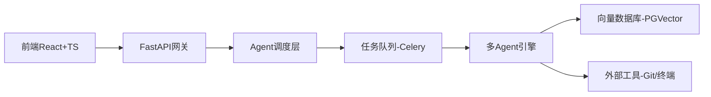

以下作为项目经理视角，针对“Python后端 + React+TS前端”的Agent原型项目规划方案，结合技术栈选型、架构设计、开发阶段划分及难点应对策略，为独立开发者提供可落地的实施路径：

---

### **一、技术栈选型与架构设计**
#### **1. 后端技术栈（Python）**
| **模块**       | **技术选型**               | **选型理由**                                                                 |
|----------------|---------------------------|----------------------------------------------------------------------------|
| **核心框架**   | FastAPI                   | 异步高性能（碾压Flask/Django），内置OpenAPI文档，适合Agent的API交互场景 |
| **Agent引擎**  | LangChain + CrewAI        | 支持多Agent协作任务分解，集成Claude 3.5/Codellama等模型    |
| **向量数据库** | PGVector（PostgreSQL扩展）| 本地化部署低成本，支持RAG知识检索，避免云服务依赖                               |
| **任务队列**   | Celery + Redis            | 异步任务调度，保障长时任务（如代码生成/测试）的可靠性                  |
| **部署**       | Docker + GCP Cloud Run    | 容器化+无服务器部署，自动扩缩容，适合独立开发者运维                  |

#### **2. 前端技术栈（React+TS）**
| **模块**         | **技术选型**          | **选型理由**                                                                 |
|------------------|----------------------|----------------------------------------------------------------------------|
| **框架**         | React 18             | 并发渲染优化用户体验，生态成熟                                     |
| **状态管理**     | Zustand + React Query| 轻量级状态管理，内置异步请求缓存，替代Redux复杂度                   |
| **UI组件库**     | Shadcn UI + Tailwind | 可定制组件，避免Ant Design的冗余打包体积                          |
| **Agent交互**    | React Flow           | 可视化Agent工作流，展示任务分解与执行状态                          |
| **类型安全**     | TypeScript 5.2       | 强制接口类型校验，减少前后端联调错误                 |

#### **3. 全栈架构图**

---

### **二、分阶段开发规划（总周期：8周）**
#### **阶段1：核心Agent引擎（W1-W3）**
- **目标**：实现任务分解→执行→结果聚合闭环  
- **关键开发**：  
  1. **任务分解Agent**：基于Claude 3.5构建，输入自然语言需求，输出JSON格式任务清单（例：`["创建API路由","生成数据库模型"]`）  
  2. **代码生成Agent**：集成CodeLlama 70B，根据任务描述生成Python/TS代码片段，支持上下文记忆（128K token）  
  3. **结果验证Agent**：调用Pytest/Jest运行单元测试，捕获错误并反馈修正  
- **交付物**：命令行版Agent，支持基础代码生成与测试  

#### **阶段2：前后端集成（W4-W5）**
- **目标**：构建管理界面，实现人机协作  
- **关键开发**：  
  1. **API网关设计**：  
     - `POST /agent/tasks`：提交任务描述，返回任务ID  
     - `WS /agent/status`：WebSocket推送任务实时状态  
  2. **前端功能模块**：  
     - 任务看板（React Flow可视化Agent工作流）  
     - 代码差异对比（Diff2Html组件展示AI修改）  
  3. **知识库连接**：上传项目文档→PGVector嵌入→RAG检索辅助决策  

#### **阶段3：生产化加固（W6-W8）**
- **目标**：提升可靠性，支持私有化部署  
- **关键开发**：  
  1. **错误熔断机制**：当Agent连续3次生成无效代码时，自动转人工干预  
  2. **安全隔离**：使用Docker沙箱运行AI生成代码，防止恶意指令  
  3. **性能优化**：  
     - 前端：React.memo+useCallback减少渲染  
     - 后端：Redis缓存高频请求结果  

---

### **三、核心难点与应对策略**
#### **难点1：复杂任务分解准确率低**
- **风险**：Agent错误拆分需求导致功能偏差  
- **应对**：  
  - 采用**Chain-of-Verification**技术：生成任务清单后，让另一个Agent反向验证合理性  
  - 提供**人工修正入口**：允许开发者拖拽调整任务顺序（React Flow支持）  

#### **难点2：生成代码与项目上下文脱节**
- **风险**：AI忽略现有架构规范，生成不可集成的代码  
- **应对**：  
  - **向量知识库**：将项目代码/文档嵌入PGVector，生成时强制检索相似代码片段  
  - **规则约束**：在Prompt中注入项目规范（如“使用Zustand而非Redux”）  

#### **难点3：多Agent协作冲突**
- **风险**：多个Agent同时修改同一文件造成冲突  
- **应对**：  
  - **文件锁机制**：通过Redis分布式锁控制写权限  
  - **版本分支**：每个任务在独立Git分支执行，完成后发起PR  

#### **难点4：独立开发者资源瓶颈**
- **风险**：全栈开发效率低下  
- **应对**：  
  - **AI辅助工具链**：  
    - 后端：Cursor（Claude 3.5驱动）生成Python业务逻辑  
    - 前端：Gemini Code Assist补全React组件（180k次/月免费额度）  
  - **模板化开发**：  
    - 使用`npx create-react-app --template typescript`初始化项目  
    - FastAPI集成`cookiecutter`生成标准结构  

---

### **四、资源分配与里程碑**
| **周期** | **重点任务**                  | **AI工具辅助点**                          | **交付验收标准**                     |
|----------|-----------------------------|------------------------------------------|-----------------------------------|
| W1-2     | Agent引擎基础能力             | Cursor生成LangChain调用模板               | 完成自然语言到任务清单的转换        |
| W3-4     | 前后端通信+管理界面           | Gemini Code Assist编写React Hook          | 可视化展示多Agent工作流            |
| W5-6     | 知识库集成+错误处理           | ChatGPT设计RAG检索Prompt                 | 正确回答项目技术栈相关问题          |
| W7-8     | 安全加固+性能优化             | Cursor生成Dockerfile与k8s配置             | 单任务平均响应<3s，错误率<5%       |

> **成本控制提示**：优先使用免费AI工具（Cursor/Gemini），向量数据库选PGVector避免Pinecone费用，部署用GCP免费额度。

---

### **五、为什么此方案更适配独立开发者？**
1. **技术栈精简**：  
   - 前后端均选用**高开发效率框架**（FastAPI/React），避免Django全栈或Flask+Jinja的模板维护成本  
2. **AI深度融合**：  
   - 利用Cursor的**Agentic Coding**能力：自动生成Celery任务队列/PGVector连接代码  
   - Gemini的**实时补全**：减少TS类型定义时间（如自动推导`useState<ICompany[]>`）  
3. **渐进式复杂化**：  
   从CLI工具→Web管理界面→生产部署，每阶段产出可验证原型，降低失败风险  

> 执行建议：从**阶段1命令行原型**起步，用2周验证Agent核心能力可行性，再投入前端开发。遇到生成代码质量问题时，优先优化Prompt而非更换模型（提示词参考：[Replit Agent设计](citation:4)）。